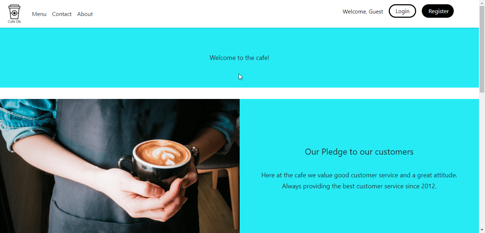
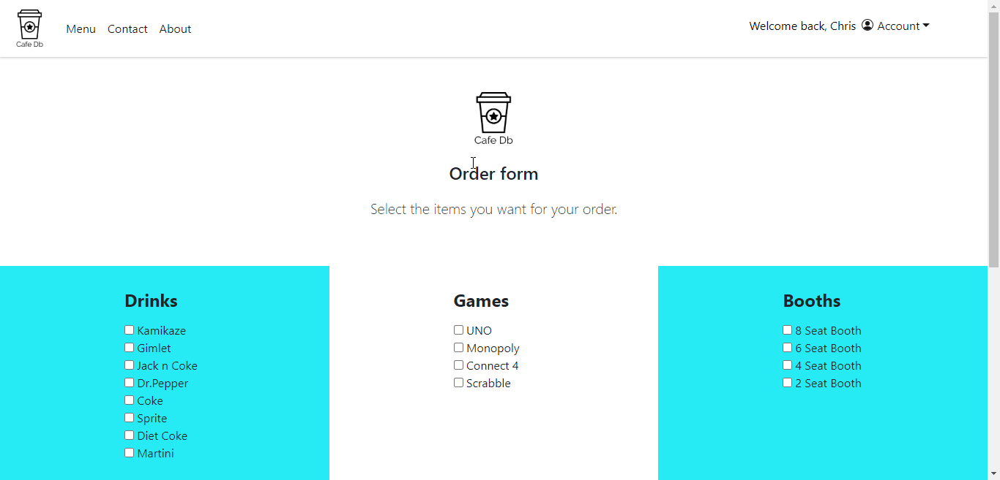
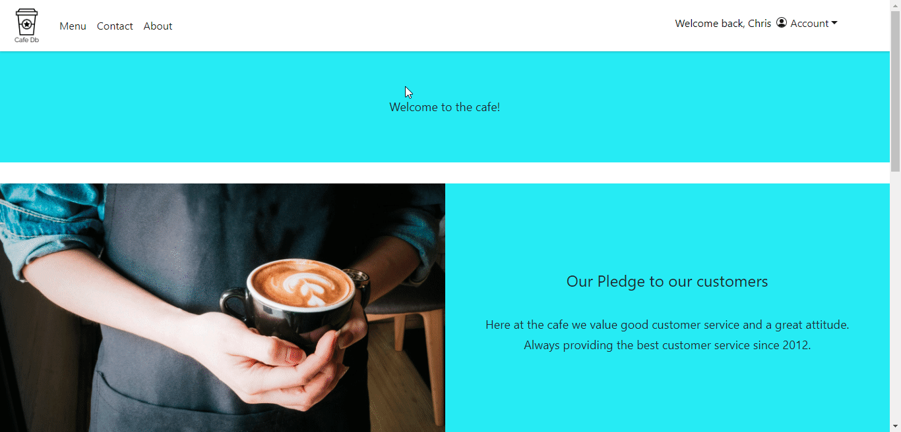
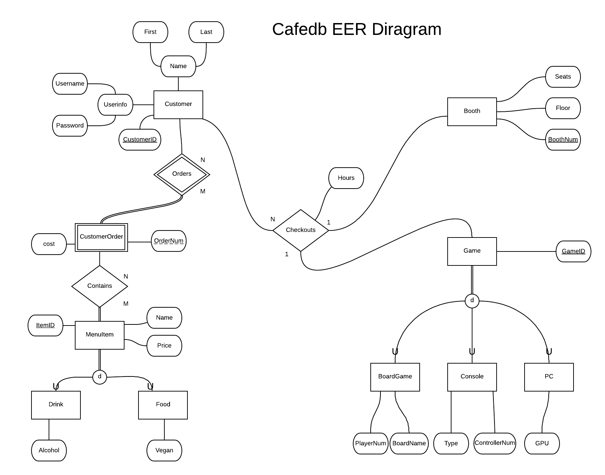
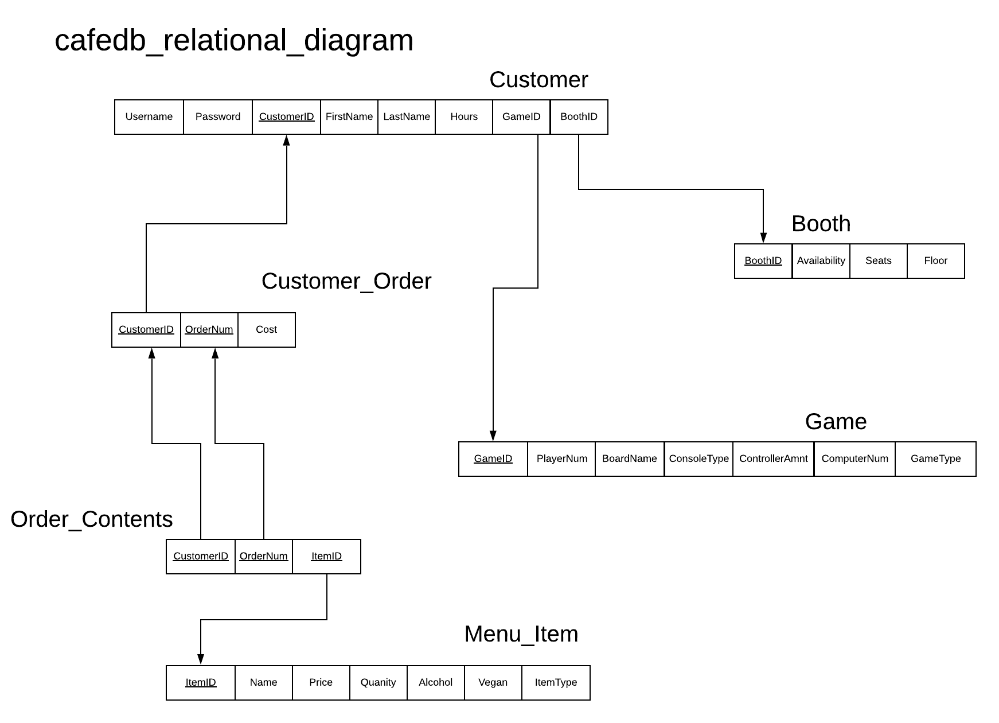
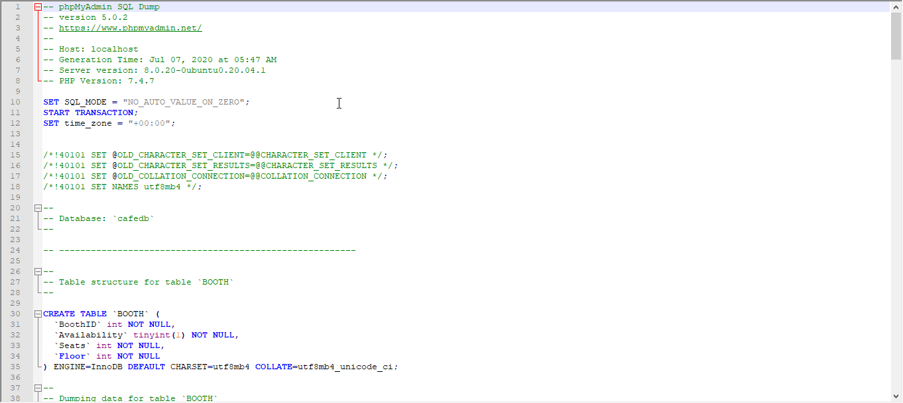

# GamingLoungeDataBase

A fullstack web application made for a cafe gaming lounge business. 

Technologies
HTML, CSS, BOOTSTRAP, PHP and MYSQL

## Features

A register/login system used for new users to create accounts and existing users to sign into their own accounts. A query is made to the database using php to create a new user when registering. If a user is signing in then the username and password is checked if it exists in the database for verification. 

A logged in user is allowed to create orders that are stored in the database. The database holds all customer orders and the cost of each order by order number. Users are allowed to look at their order history. 

A session is created for a logged in user using php. When the user logs out the session is destoryed.

## Database Design

Enhanced Entity Relationship Diagram was used to initially design the database. Many customers are allowed to checkout one boardgame, console, or PC and booth at one time. Many customers are allowed to order items and each order contains many items. 

The EER diagram was then converted to a relational diagram. 

From the diagrams created the sql code was generated to create the database.

#Lessons

From this project I learned how to work with backend languages. Php queries to the database for verification, data storage and data retrieval. 
